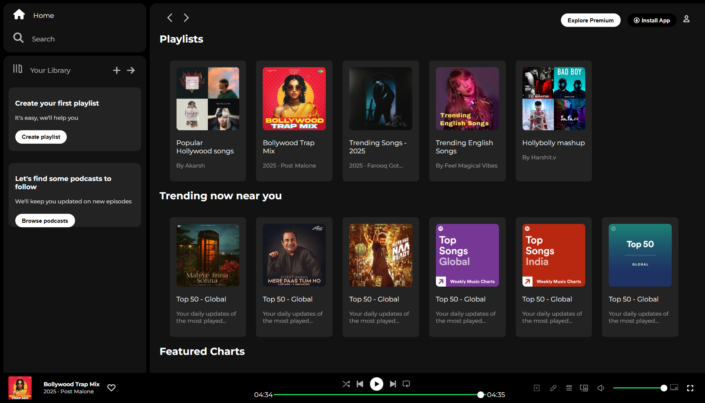

# Spotify Clone 🎵
### Home Page


## 📝 Description
A frontend clone of Spotify built using HTML, CSS, and JavaScript. It mimics the core UI and playback features of the Spotify web player.

## 🚀 Features
- Custom music player UI
- Play/Pause, Next, Previous functionality
- Progress bar
- Responsive layout for desktop and mobile

## 🛠️ Tech Stack
- HTML5
- CSS3

## 📁 Folder Structure
```
📂SpotifyClone  
├── index.html  
├── index.css  
├── 📂assets/  
│   └── images
```

## 📦 How to Run
```bash
git clone https://github.com/Hitesh-Bhor28/SpotifyClone.git
cd SpotifyClone
Open index.html in your browser
```

## 📌 Future Improvements
- Add volume control
- Add user login
- Integrate with Spotify API
- Dynamic user Interaction
